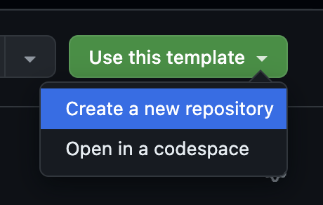

Hi 👋

If you're receiving this, you're a candidate for the Software Engineering role in the Advocacy team 🥑 at Electricity Maps.

Firstly, thank you for applying. We are excited to get to know you better.

The goal of this task is for us to understand your technical ability and give us some points to discuss in our interview(s). We want to closely replicate the work we do at Electricity Maps, so you'll be working with our React web app.

How to approach this task:
Time required - 90 minutes maximum (your time and ours is valuable). Let's keep it as short as possible. Pushing unfinished work or asking for pointers is fine!

Step 1:
Create a new repo from this template and make it private.

👇



Step 2:
Clone it locally and get the project up and running.

Create a new branch to develop on.

```bash
cd web
pnpm i
pnpm dev
```

Visit the [dev server](http://localhost:5173/map?remote=true).

The remote=true query param should get you some data for the map, but you'll still probably get errors if you click on a zone (bonus points if you can find the token that allows this, but don't waste time on this just now).

Step 3:
Replace the BottomSheet we use from react-spring-bottom-sheet with [this more lightweight alternative](https://www.npmjs.com/package/bottom-sheet-dialog).

Step 4:
Push your changes to your private repo, create a PR explaining the changes, and try to explain reasons why this change is good. Is there anything measurably different? Then invite @tonypls and @VIKTORVAV99 as reviewers, and we'll get back to you when we've reviewed.

Congrats 🎉
